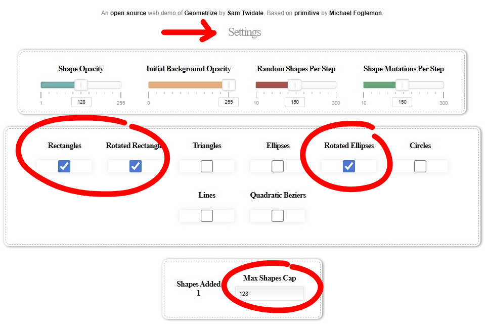

# Armored Core VI Emblem Creator

Introducing Emblem Creator, a user friendly tool that allows you to effortlessly import your own images into ACVI to use as emblems on your Armored Core and share online. The tool leverages data from the [Geometrize library](https://github.com/Tw1ddle/geometrize-haxe) which decomposes arbitrary images into geometric primitives. This vector format is then converted to the game's native emblem format and imported into the game. It's easy to use, it's fast, give it a try!

🡺 **[Download the latest release!](https://github.com/pawREP/ACVIEmblemCreator/releases/latest)**

 🡺
 🡺

## How to use:
  *Before you do anything, make a backup of your save file. This tool imports emblems directly into your save file and, while unlikely, save file corruption is always a possibility. Better save than sorry. You can find your save file under `%AppData%\Roaming\ArmoredCore6\{SteamID}\AC60000.sl2`. Also be aware that modding always comes with risks. While there is currently no indication that importing emblems is unsafe, it's neither a guarantee nor does it mean the situation can't change in the future. Proceed at your own risk!*

With that out of the way, get the latest release version **[here](https://github.com/pawREP/ACVIEmblemCreator/releases/latest)** and follow the instructions below.

### Image conversion

First, the image has to be converted into a suitable vector format. This is currently most conveniently done using @Tw1ddle's excellent [Geometrize Web App](https://www.samcodes.co.uk/project/geometrize-haxe-web/). Since Armored Core imposes limitations on the number of layers per emblem we have to adjust the settings in Geometrize accordingly. To do this open the settings tab and set the `Max Shapes Cap` to `128` or lower. Of the available shapes, `Rectangles`, `Rotated Rectangles` and `Rotated Ellipses` are currently supported. You can choose any combination of those three. All other settings can be tweaked freely to achieve the look you desire. 

Now to generate an image, import a reference image using `Open Image` and `Run` the process until 128 shapes have been generated. The reference image should ideally be square or it will be stretched to be square during the import process. Once the generations is done, export the result using `Save Json`.

### Import

To import the converted json files into the game simply select all the desired json files as well as your save file (`AC60000.sl2`) and drag them all onto `EmblemCreator.exe`. If no error messages occurred during the import process, the images are now part of your save file. Put the save back where you found it in case you moved it, boot up the game, enjoy and share your new emblems.

# FAQ
-
