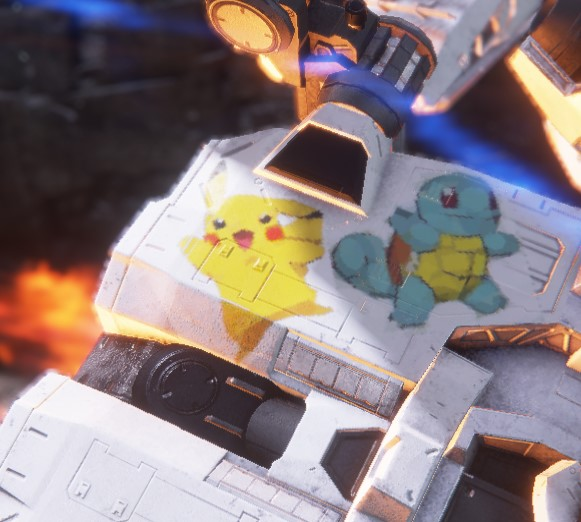

# Armored Core VI Emblem Creator

Introducing Emblem Creator, a user friendly tool that allows you to effortlessly import your own images into ACVI to use as emblems on your Armored Core and share online. The tool leverages data from the [Geometrize library](https://github.com/Tw1ddle/geometrize-haxe) which decomposes arbitrary images into geometric primitives. This vector format is then converted to the game's native emblem format and imported into the game. It's easy to use, it's fast, give it a try!

🡺 **[Download the latest release!](https://github.com/pawREP/ACVIEmblemCreator/releases/latest)**

 🡺
 🡺

## How to use:
  *Before you do anything, make a backup of your save file. This tool imports emblems directly into your save file and, while unlikely, save file corruption is always a possibility. Better save than sorry. You can find your save file under `%AppData%\Roaming\ArmoredCore6\{SteamID}\AC60000.sl2`. Also be aware that modding always comes with risks. While there is currently no indication that importing emblems is unsafe, it's neither a guarantee nor does it mean the situation can't change in the future. Proceed at your own risk!*

With that out of the way, get the latest release version **[here](https://github.com/pawREP/ACVIEmblemCreator/releases/latest)** and follow the instructions below.

### Basic Usage

* Start `EmblemCreator.exe` to bring up the importer gui.
* Click `Load Image` and select a `.jpg` or `.png` file to use as a source. This image should be square or it will be stretched to be square during import.
* Once the image is loaded some additional settings to customize the generation process come up. You can leave them as default to start with.
* Click `Generate!` to start the vectorization process. You'll see the image get build up on the left. Once the `shape count limit` as been reached the generation will automatically stop. 
* *Optionally* use chroma keying and other available options to customize the generated image. For example to key out a background or remove the automatically generated background shape. If you are using those features it can be helpful to increase the shape count limit during generation a bit so you still end up with 128 shapes by the end to fill up a full emblem. Use the `Shape Limit` slider to reduce the final number of shapes to 128 if you don't want the image to be split into multiple emblems during import.
* Use `Open .sl2` to select a armored core VI save file. 
* Finally, press `Export to Game` to write the generated emblem to your save file. If everything went well, you'll see a little `Success` confirmation.
* Boot up the game and you should find the new emblem in the image editor under User1
### Advanced usage
  Since there is a hard limit of 128 per emblem in-game it can be difficult to represent images with a lot of detail. One way to get around this issue is to generate multiple emblems from a single reference image and layer them in-game. To do this simply increase the `Shape Count Limit` to a higher value before generating. The `Drawn Shape Count` above the export button indicates how many shapes are currently being displayed after all post processing steps have been applied. You can always reduce the number further by using the `Shape Limit` slider. To get the best image quality it's good idea to generate about as many shapes as needed and not crop off a large number of shapes at the end. Enabling more shape types and increasing candidate and mutation count can also increase image quality at the cost of generation time.
